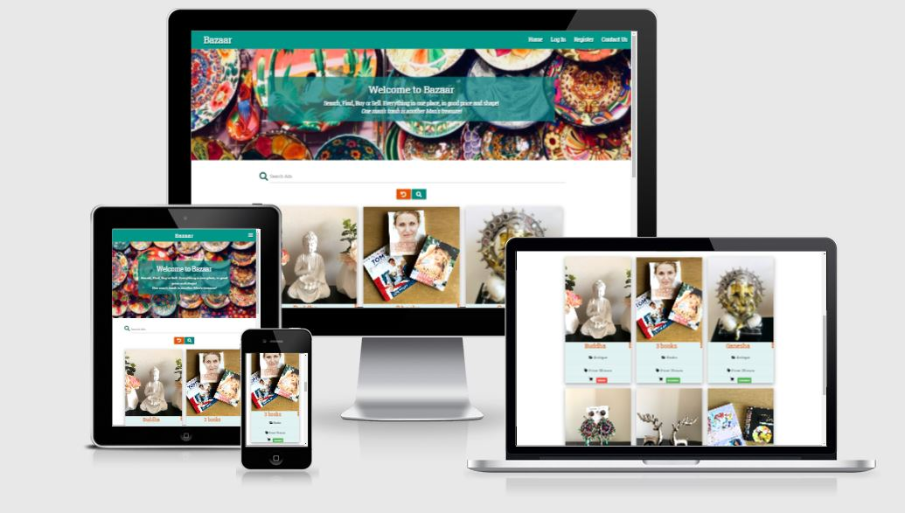
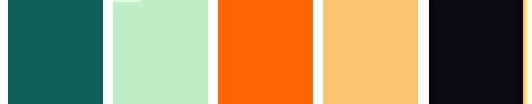

# Bazaar
  ### *Buy what you want, Sell what you don't*.
  
### A Webpage for buying and selling of second hand goods.

[View live site here](https://ms3-bazaar.herokuapp.com/get_ads)

This webpage is developed by me for my Third Milestone Project for Code Institute.
This site is made by using **HTML**, **CSS**, **javascript**, **Python**, **MongoDB**, and **Flask Framework**. 
The purpose of this site is to show CRUD functionality and Database accessibilty.
***

## **Table of Content**

* [Overview](#overview)

* [User Experience](#user-experience)
    
    * [User Goals](#user-goals)
    * [Business Goals](#business-goals)
    * [User Stories](#user-stories)
    * [Business Stories](#business-stories)

* [Planes of Development](#planes-of-development)
    * [Strategy](#strategy)
    * [Scope](#scope)
    * [Structure](#structure)
    * [Skeleton](#skeleton)
        * [Wireframe](#wireframe)
        * [Database Schema](#database-schema)
        * [Sitemap](#sitemap)
    * [Surface](#surface)
        * [Color](#color)
        * [Typography](#typography)
        * [Images](#images)

* [Features](#features)
    * [Features Used](#features-used)
    * [Features to be implementd in Future](#features-to-be-implemented-in-future)

* [Technologies used](#technologies-used)
    * [Languages Used](#languages-used)
    * [Integration](#integration)
    * [Workspace version control and Repository storage](#workspace-version-control-and-repository-storage) 
    * [Other](#other)

* [Resources](#resources)

* [Testing](#testing)

* [Deployment](#deployment)
    * [Initial Deployment](#initial-deployment)
    * [How to Fork it](#how-to-fork-it)
    * [How to Clone it](#how-to-clone-it)
    * [Making a Local clone](#making-a-local-clone)

* [Credits](#credits)
    * [Code](#code)
    * [Content](#content)
    * [Media](#media)
    * [Acknowledgments](#acknowledgments)
***

## **Overview**

A Bazaar is a permanently enclosed marketplace or street where good and services are exchanged or sold. The term bazaar originates from the Persian word **bazar**.

I decided to keep *Bazaar* as name of my site because it also server that purpose.

This website is created as a platform to meet and know about potential buyers and sellers.

This is created for educational purpose only as my Third Milestone Project for Code Institute.
This site is made by using my new learned skill of Backend Development with the addition of Frontend Development.
***

## **User experience**

### **User Goals**

1. Somewhere to search for few things which I want to have and do not want to pay heavy price.
2. To find some place where I can sell some of my Favourite things, which I do not need anymore.
3. To find buyer for my favourite things, which I can't keep anymore and don't want to throw in garbage as well.
4. Buyers who are relocating, can find things in resonable rate for the initial setup of their home and office.
5. In the current Pandemic situation, User may want to browse things from the safe environment of their home.
6. User friendly website, where I don't have to be very technically educated to publish my ads.

### **Business Goals**

1. During the current world condition, when it is difficult to find Non-essential shops, this site would provide a place to buy and sell some useful items.
2. A website, where Buyer and Seller can easily contact each other, if they are interested in any product posted here.
3. An easy to navigate site, with buttons provided for these paths through the site.
4. All the items will be categorised and will be easy to search, to save the time and energy of everyone.
5. The site owner will have the full control on every post, and He/She can add or remove categories or ads.

### **User Stories**
 **Visitor Stories**
1. As a new visitor, I want to be able to easily find the product that I am looking for.
2. As a new visitor, I want to search the product by using simple words, it should not be always the keyword.
3. As a new visitor, I want to first select the item by its appearance and price.
4. As a new visitor, I want to contact the seller if I want to buy Something.
5. As a new visitor, I want to be able to contact the admin of the page if I am not satisfied with my purchase.
6. As a new visitor, I want to register my account easily if I want to sell something.
7. As a visitor, I want to know if the product is available or not, before clicking and viewing full details.
8. As a returning visitor, I want to login easily and make some changes in my product. i.e. price.
9. As a returning visitor, I want to login easily and remove my product from the site if it is sold.
9. as a regular visitor, I want to navigate easily through the pages.
10. As a regular visitor, I want to see details of each item clearly.
11. As a regular visitor, I want to login from my mobile and expect the site and image to be fully responsive.
12. As a seller, I want to see all the items posted by me in one place, so that I can take decisions on that.

### **Business Stories**

  As the site owner I want/expect/need:
  1. To display the ads in a colourful manner.
  2. To manage all the ads posted in the site and delete any appropriate one.
  3. To add more categories later if required.
  4. The Buyers/Sellers can contact me easily through a contact form or they can find me in social media accounts.
  ***

## **Planes of Development**
### **Strategy**

The aim of making this site is to make a website which has CRUD mechanism and Database access functionality.
I decided to make a second Hand goods buying and selling site, which will work as a platform for peoples to meet potential buyers for their things, 
as well buyers can find items in resonable rates.

### **Scope**

I want to make a website which is accessible to everyone, People can browse items without being Registered, so that there will be no hesitation in searching anything.
People can post their items for sell using simple steps and buyers can contact sellers from the contact details provides.
It will be easier to see details of every item as it will open in a new page. 
Users can contact the admin easily for Feedback or Complaints. Sellers can see all the ads posted by them in their profile page.

### **Structure**

This website will be a multi-page site, where pages are connected through Navigation Bar or Python. 
The navigation bar will have links for home page, Login, Register and Contact form. The navigation links will change and show logout and Post ad option Once the user is logged in.
The navigation bar will be collapsible for Mobile view and expand in sidebar when clicked.
There will be a footer, which will show the contact details of the admin. It will be sticky and always remain in the end of the page.
2 forms will be there, one for Login and other for Registeration. 
One contact form will also be there for the users to contact the admin.
There will be pages for Posting the ads and Editing the already published ads.
Users can delete their posts if they want.
Admin will have the power to delete any post, if that is unsuitable for the page.
All the data will be stored in MongoDB and Flask framework will be used to develop the site and finally it will be deployed by using Heroku.

### **Skeleton**
#### **Wireframe**
The wireframe for this project has been made for Three screen sizes(Mobile View, Tablet View, and Laptop View). Each page is shown in all three 
screen sizes on a single page foe a better understanding of the responsiveness of the page.

The wireframes for this Project can be seen here.
[Wireframe](static/images/wireframe.pdf)

#### **Database Schema**
The Schema is pepared for the better understanding of the Database Collection.

This Project has 4 collection. Ads, Category types, Condition of goods and Users.

Database Schema can be seen here. [Schema](static/images/schema.pdf)

#### **Sitemap**
Sitemap is prepared for this site to understand the navigation of the pages.

Sitemap can be seen here. [Sitemap](static/images/sitemap.pdf)

### **Surface**
#### **Color**
The color theme is used from Materializecss.com. It is decided by keeping Hero image in consideration and mainly two colours teal(#009688 ) 
and orange(#ff9800) and their shades are used according to the page requirement.

#### **Typography**
Google font **Roboto Slab** with a fallback of **sans serif** is selected for the entire project.

#### **Images**
The images used in this project are taken by the developer and are subject of demonstration only.
The Hero Image is taken from Pexel.com. It is a market image of Dubai, clicked by Sanketh Rao.
***

## **Features**

### **Features Used**

**Navigation Bar**

### **Features to be implemented in future**

***
## **Technologies used**

### **Languages Used**

### **Integration**

### **Workspace version control and Repository storage**

### **Other**

***
## **Resources**
***

## **Testing**

**The detailed testing report can be found here** [Testing](TESTING.md)

***
## **Deployment**

### **Initial Deployment**

### **How to Fork it**

### **How to Clone it**

### **Making a Local clone**

***

## **Credits**

### **Code**

### **Content**

### **Media**

### **Acknowledgments**

***

