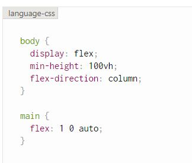

# Bazaar
  ### *Buy what you want, Sell what you don't*.
  
### A Webpage for buying and selling of second hand goods.

[View live site here](https://ms3-bazaar.herokuapp.com/get_ads)

This webpage is developed by me for my Third Milestone Project for Code Institute.
This site is made by using **HTML**, **CSS**, **javascript**, **Python**, **MongoDB**, and **Flask Framework**. 
The purpose of this site is to show CRUD functionality and Database accessibilty.
***

## **Table of Content**

* [Overview](#overview)

* [User Experience](#user-experience)
    
    * [User Goals](#user-goals)
    * [Business Goals](#business-goals)
    * [User Stories](#user-stories)
    * [Business Stories](#business-stories)

* [Planes of Development](#planes-of-development)
    * [Strategy](#strategy)
    * [Scope](#scope)
    * [Structure](#structure)
    * [Skeleton](#skeleton)
        * [Wireframe](#wireframe)
        * [Database Schema](#database-schema)
        * [Sitemap](#sitemap)
    * [Surface](#surface)
        * [Color](#color)
        * [Typography](#typography)
        * [Images](#images)

* [Features](#features)
    * [Features Used](#features-used)
    * [Features to be implementd in Future](#features-to-be-implemented-in-future)

* [Technologies used](#technologies-used)
    * [Languages Used](#languages-used)
    * [Integration](#integration)
    * [Workspace version control and Repository storage](#workspace-version-control-and-repository-storage) 
    * [Other](#other)

* [Resources](#resources)

* [Testing](#testing)

* [Deployment](#deployment)
    * [Initial Deployment](#initial-deployment)
    * [How to Fork it](#how-to-fork-it)
    * [How to Clone it](#how-to-clone-it)
    * [Making a Local clone](#making-a-local-clone)

* [Credits](#credits)
    * [Code](#code)
    * [Content](#content)
    * [Media](#media)
    * [Acknowledgments](#acknowledgments)
***

## **Overview**

A Bazaar is a permanently enclosed marketplace or street where good and services are exchanged or sold. The term bazaar originates from the Persian word **bazar**.

I decided to keep *Bazaar* as name of my site because it also server that purpose.

This website is created as a platform to meet and know about potential buyers and sellers.

This is created for educational purpose only as my Third Milestone Project for Code Institute.
This site is made by using my new learned skill of Backend Development with the addition of Frontend Development.
***

## **User experience**

### **User Goals**

1. Somewhere to search for few things which I want to have and do not want to pay heavy price.
2. To find some place where I can sell some of my Favourite things, which I do not need anymore.
3. To find buyer for my favourite things, which I can't keep anymore and don't want to throw in garbage as well.
4. Buyers who are relocating, can find things in resonable rate for the initial setup of their home and office.
5. In the current Pandemic situation, User may want to browse things from the safe environment of their home.
6. User friendly website, where I don't have to be very technically educated to publish my ads.

### **Business Goals**

1. During the current world condition, when it is difficult to find Non-essential shops, this site would provide a place to buy and sell some useful items.
2. A website, where Buyer and Seller can easily contact each other, if they are interested in any product posted here.
3. An easy to navigate site, with buttons provided for these paths through the site.
4. All the items will be categorised and will be easy to search, to save the time and energy of everyone.
5. The site owner will have the full control on every post, and He/She can add or remove categories or ads.

### **User Stories**
 **Visitor Stories**
1. As a new visitor, I want to be able to easily find the product that I am looking for.
2. As a new visitor, I want to search the product by using simple words, it should not be always the keyword.
3. As a new visitor, I want to first select the item by its appearance and price.
4. As a new visitor, I want to contact the seller if I want to buy Something.
5. As a new visitor, I want to be able to contact the admin of the page if I am not satisfied with my purchase.
6. As a new visitor, I want to register my account easily if I want to sell something.
7. As a visitor, I want to know if the product is available or not, before clicking and viewing full details.
8. As a returning visitor, I want to login easily and make some changes in my product. i.e. price.
9. As a returning visitor, I want to login easily and remove my product from the site if it is sold.
9. as a regular visitor, I want to navigate easily through the pages.
10. As a regular visitor, I want to see details of each item clearly.
11. As a regular visitor, I want to login from my mobile and expect the site and image to be fully responsive.
12. As a seller, I want to see all the items posted by me in one place, so that I can take decisions on that.

### **Business Stories**

  As the site owner I want/expect/need:
  1. To display the ads in a colourful manner.
  2. To manage all the ads posted in the site and delete any appropriate one.
  3. To add more categories later if required.
  4. The Buyers/Sellers can contact me easily through a contact form or they can find me in social media accounts.
  ***

## **Planes of Development**
### **Strategy**

The aim of making this site is to make a website which has CRUD mechanism and Database access functionality.
I decided to make a second Hand goods buying and selling site, which will work as a platform for peoples to meet potential buyers for their things, 
as well buyers can find items in resonable rates.

### **Scope**

I want to make a website which is accessible to everyone, People can browse items without being Registered, so that there will be no hesitation in searching anything.
People can post their items for sell using simple steps and buyers can contact sellers from the contact details provides.
It will be easier to see details of every item as it will open in a new page. 
Users can contact the admin easily for Feedback or Complaints. Sellers can see all the ads posted by them in their profile page.

### **Structure**

This website will be a multi-page site, where pages are connected through Navigation Bar or Python. 
The navigation bar will have links for home page, Login, Register and Contact form. The navigation links will change and show logout and Post ad option Once the user is logged in.
The navigation bar will be collapsible for Mobile view and expand in sidebar when clicked.
There will be a footer, which will show the contact details of the admin. It will be sticky and always remain in the end of the page.
2 forms will be there, one for Login and other for Registeration. 
One contact form will also be there for the users to contact the admin.
There will be pages for Posting the ads and Editing the already published ads.
Users can delete their posts if they want.
Admin will have the power to delete any post, if that is unsuitable for the page.
All the data will be stored in MongoDB and Flask framework will be used to develop the site and finally it will be deployed by using Heroku.

### **Skeleton**
#### **Wireframe**
The wireframe for this project has been made for Three screen sizes(Mobile View, Tablet View, and Laptop View). Each page is shown in all three 
screen sizes on a single page foe a better understanding of the responsiveness of the page.

The wireframes for this Project can be seen here.
[Wireframe](static/images/wireframe.pdf)

#### **Database Schema**
The Schema is pepared for the better understanding of the Database Collection.

This Project has 4 collection. Ads, Category types, Condition of goods and Users.

Database Schema can be seen here. [Schema](static/images/schema.pdf)

#### **Sitemap**
Sitemap is prepared for this site to understand the navigation of the pages.

Sitemap can be seen here. [Sitemap](static/images/sitemap.pdf)

### **Surface**
#### **Color**
The color theme is used from Materializecss.com. It is decided by keeping Hero image in consideration and mainly two colours teal(#009688 ) 
and orange(#ff9800) and their shades are used according to the page requirement.

#### **Typography**
Google font **Roboto Slab** with a fallback of **sans serif** is selected for the entire project.

#### **Images**
The images used in this project are taken by the developer and are subject of demonstration only.
The Hero Image is taken from Pexel.com. It is a market image of Dubai, clicked by Sanketh Rao.
***

## **Features**

### **Features Used**

#### *Elements on every page*

**Navigation Bar**

* [MaterializeCSS](https://materializecss.com/navbar.html) is referred for making the Navigation Bar.
* Navigatin Bar is situated on the top of the page with the **Bazaar** logo on left and menu on right.
* The menu is collapsible in mobile view and opens in sidebar, in mobile view the logo is situated in the middle of the Navbar. 
* The Navbar menu have **Home**, **Login**, **Register** and **Contact Us** link for every visitor who visites the site.
* The Navbar menu will change to **Home**, **Profile**, **Post Ad**, **Logout** and **Contact us** after the visitor logged in.
* The **Manage categories** link is visible only to Admin of the site.

**Footer**

* The Footer is situated at the bottom of every page. Which is having Copyright information and My Github and Linkedin account links.
* [MaterializeCSS](https://materializecss.com/footer.html) is used to make the footer syckey at the bottom of every page, 
by adding one code in the CSS Style sheet.
* The code added to style sheet is this.

   

#### *Elements on different pages*

**Home Page**

* One Hero Image is there on the Home page, which is very colourful image of a marketplace in Dubai. It is taken from 
  [Pexel.com](https://www.pexels.com/photo/assorted-commemorative-plates-716107/)
* A welcome note is situated on the Hero Image to give the introduction about the site and its purpose.
* A search Bar is given to search for ads through their keywords.
* Ad image cards are there as 3 in a row, Which shows image of the Ad and details about its name and vailability. 
 It is reponsive and changes to 2 in a row for medium size screen and 1 in a row for Small size(mobile) screen.
* The card image will open a new page when clicked on it, that page will have details for individual Ads.

**View Ad Page**

* This page opens after clicking on the Ad card in **Home** page.
* This page have a full size image of the Ad and Deatail of it. The details shown are 
  1. Ad Title
  2. Category
  3. Ad Description
  4. Price
  5. Condition (New, Good as New or Used)
  6. Location
  7. Posted by
  8. Email
  9. Telephone
  10. Availability (Available or Sold)
* The availabity is shown by a **tooltip and one **badge** also, which is *Green* in colour for available ads and *Red* for sold.
* There is a **Back** button on top of the page which takes back to the **Home** page.
* One **Edit** and One **Delete** button is also there on the top of the page, which is visible only to the owner of the Ad(Posted by) and to the Admin of the site.

**Login Page**

* The **Login** page has a form input for **Username** and **Password**. The input section will become Red if the certain input conditions are not fulfilled.
 For example- Usename and Password should be 5-15 characters alphanumeric word with no spaces.
* There is one **Login** button which directs the User to **Profile** page after login.
* For new users, One link is given to direct them to the Register page.
* One flash message saying "Username or Password is Incorrect" will show if the Username or Password is Incorrect.

**Register Page**

* The Register page will have a form to enter Username and Password. This will also have some input conditions, same as the Login Form.
* Submit button is there, which will take the user to Profile page with a message of "Registration Successful" and a message which tells that user has not 
 posted anything yet.
* For returning Users, One Login link is given below the form.

**Contact Us Page**

* One contact form is given which is visible to every users, even if user has not registered with the site. 
* It is addressed as **Suggestions and Complaints** , So that user user will feel free to give any suggestions and complaints if they have any.
* It has **Full name**, **Email**, and one **Feedback** section. 
* Feedback section is a Textarea.
* One **Cancel** and one **Submit** button are given. The Submit button's text will change to **Feedback Sent** after successfully sending the feedback. 
  One message will also pop up stating that **Your Feedback is submitted** or **Try Again** if it fails.
* This contact form code is referred from my second Milestone project with some changes in the email template.

**Profile Page**

* The profile page is the first page the user see after logging in or Registering for the first time.
* This page has One Welcome note with current user name.
* This page will show all the Ads posted by the user. If the User has not posted anything then 
  it will show a link to Post Ad page, Where User can post it's ads.

**Post Ad Page**

* Ths Post ad is a form with many different types of inputs. The input fields are-
  1. Category (Dropdown)
  2. Photo URL ( in https form)
  3. Ad Title
  4. Ad Description (textarea)
  5. Price
  6. Condition(Dropdown)
  7. Location
  8. Telephone
  9. Email
  10. Availability(Switch)
* This form has one button to Post the Ad.
* Once the Ad is posted the user is directed to the Home Page.
* The Categories included are 
  1. Antique
  2. Art
  3. Books
  4. Electronic
  5. Fashion
  6. Games
  7. Household
  8. Jewellery
  9. Shoes
    These categories can be added or removed by the Admin.
* The Condition Field have 3 types of conditions, from which the user can select one.
  1. New
  2. Good as New
  3. Used
* The availability switch have 2 conditions **Available** and **Sold**.
* Each input section is compulsory and is validated by adding one Materialize code in Script page. This code is provided by Code Institute.

**Edit Ad Page**

* This page looks same as Post Ad page.
* This page is directed from the View Ad page, where a button is given to Edit the post. 
  That button is only visible to the owner of the post and Admin of the site.
* When the Ad owner clicks the edit button, all the fields populate with already filled data, which makes it easier to make the changes.
* 2 buttons are given in the bottom of the form. One to Edit the changes and One to Cancel any changes. 
* The **Edit Ad Button** will remain on the page with a flash message of " Ad Successfully Updated".
* The **Cancel button** will bring the User to the Home page.

**Delete Ad**

* The Delete Ad feature is given to every ad with a button on the view Ad page, Which is visible to only the Owner of the post and the Admin of the site.
* When the Delete button is clicked One modal pops up, with a message of **Confirm Deletion**, which has 2 buttons, 
  The **Cancel** button cancels the modal and user remains on the same page. The **Delete** button deletes the ad and takes the user to the **Home Page**.

**Manage Categories**

* This section is visible only to the Admin. After logging in Admin can see this link in the Navbar. 
* This page will have one **Add Category** button on the top of the page.
* All the categories are shown there with one Edit and one Delete button with every category.
* The edit button will take the admin to the Edit Category page.
* The Delete button will popup one modal with **Confirm Deletion** message.  which has 2 buttons, 
  The **Cancel** button cancels the modal and Admin remains on the same page. 
  The **Delete** button deletes the Category the Admin remains on the **Manage Category** page.

**Delete Modal**

* The Delete funtion of the site has given a defensive programming by adding one Modal from MaterializeCSS. 
* The modal asks about the confirmation and works accordingly.
* This Modal is referred from [MaterializeCSS.com](https://materializecss.com/modals.html)

**Logout**

* The **Logout** link is given in the Navbar and visible only after the user is logged in.
* When clicking on the Logout link, The user is logged out from the session and directed back to LogIn page.

**Error Handler**

* Two Error Handlers are provided for the better performance of the site, if something wrong happens.
* One is 404 error handler and another is 500 Internal error handler.
* This pages have one image of a man looking at the 404 written and looks confused.
* The text tells them to click on the **Ads** word, which directs the user to the **Home page**.

### **Features to be implemented in future**

***
## **Technologies used**

### **Languages Used**

### **Integration**

### **Workspace version control and Repository storage**

### **Other**

***
## **Resources**
***

## **Testing**

**The detailed testing report can be found here** [Testing](TESTING.md)

***
## **Deployment**

### **Initial Deployment**

### **How to Fork it**

### **How to Clone it**

### **Making a Local clone**

***

## **Credits**

### **Code**

### **Content**

### **Media**

### **Acknowledgments**

***

