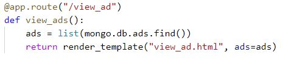

#  Testing page for Bazaar
  ### *Buy what you want , Sell what you don't*.

### A Webpage for buying and selling of second hand goods.

[Main README.md file](README.md)

[View live site here](https://ms3-bazaar.herokuapp.com/get_ads)

## Testing

* [Code Testing](#code-testing)
    * [Markup](#markup)
    * [CSS](#css)
    * [Javascript](#javascript)
    * [Python](#python)

* [Client Stories Testing](#client-stories-testing)

* [Manual Testing](#manual-testing)

    * [Elements on every page](#elements-on-every-page)
       * [Navigation Bar](#navigation-bar)
       * [Footer](#footer)
       * [Flashed messages](#flashed-messages)
    * [Elements on separate page](#elements-on-separate-page)
       * [Home Page](#home-page)
       * [View Ad Page](#view-ad-page)
       * [Post Ad Page](#post-ad-page)
       * [Edit Page](#edit-page)
       * [Delete Modal](#delete-modal)
       * [Profile Page](#profile-page)
       * [Manage Catagory Page](#manage-catagory-page)
       * [Contact Us Page](#contact-us-page)
       * [Login Page](#login-page)
       * [Register Page](#register-page)

* [Responsiveness](#responsiveness)

* [Browser Compatibility](#browser-compatibility)

* [Lighthouse](#lighthouse)

* [Project Barrier](#project-barrier)

* [Bug Report](#bug-report)
    * [Bug Found and Resolved](#bug-found-and-resolved)
    * [Open Bug](#open-bug)
***

## **Code Testing**
  [W3C Markup Validation Service](https://validator.w3.org/)

### **Markup**
 [W3C Markup Validation Service](https://validator.w3.org/)

  * W3C markup validation service is used for the testing of the **HTML** of all  HTML pages and 

    The results can be seen here.

### **CSS**
[W3C CSS Validation Service](https://jigsaw.w3.org/css-validator/)

* W3 CSS validation service is used for the testing of the **CSS** of the project and .

    The result can be seen here.

* [style.css]()

### **Javascript**
[JSHint](https://jshint.com/)

* JSHint, a JavaScript code quality tool was used to test the **JavaScript** codes of all 3 js pages from the project.

    The result can be seen here.

*  

### **Python**
[Python Validator](http://pep8online.com/)

***
## **Client Stories Testing**

Testing client stories from UX part of [README.md](README.md) 
 
1. As a new visitor, I want to be able to easily find the product that I am looking for.
    * This website has agiven a search functionality, which searches ads based on the words from ad title and ad description.
    * The search bar is situated in the Home page, below the Hero image. So, it is very easy to find out.

2. As a new visitor, I want to search the product by using simple words, it should not be always the keyword.
    * The keyword to function the search engine is any word from the ad title and ad description. So it can be just games, books, new anything.

3. As a new visitor, I want to first select the item by its appearance and price.
    * The Home page have card displayed, but they dont show full details of that particular card.
    * The Ad card show only Image, Price, Category and Status about its availability.
    * When someone likes anything and it is showing available then He/She can click the card, which takes them to a new page with description.
    * this kind of display saves time and users can decide easily.

4. As a new visitor, I want to contact the seller if I want to buy Something.
    * The selller's email id and Telephone number are given in the detailed Ad card page. 
    * The buyer can contact easily with the seller if the thing is available.
    
5. As a new visitor, I want to be able to contact the admin of the page if I am not satisfied with my purchase.
    * A contact Form is given with the site, the link of which can be found in the Navbar.
    * This contact form has title Suggestions and Complaints, so that user can give anyting in feedback.
    * The admin's contact details (Github and Linkedin) are given in the Footer also.

6. As a new visitor, I want to register my account easily if I want to sell something.
    * The link to Registration form is given in the Navbar, which is visible to anyone who is visiting the site.
    * The Registration form clearly states the conditions to Register as, Username and Password must be 5-15 characters long, with only numbers and letters.
    
7. As a visitor, I want to know if the product is available or not, before clicking and viewing full details.
    * A Red badge for Sold and a Green badge for Available items is given with every Ad card.
    * The badge is visible on the Home page only, which is helpful for the visitor to decide.
    * One tooltip is also given with the badge which shows the availability(Available or Sold) when the user hover over it.

8. As a returning visitor, I want to login easily and make some changes in my product. i.e. price.
    * The login form is given in the Navbar, so it is easy to find. 
    * After Logging in the user is directed to the Profile Page which shows all the ads posted by the user.
    * When the user clicks on the particular card, it opens in full view and Edit button is also visible on the top of the page.
    * After clicking the edit button , the user is directed to the edit Ad page , where user can make any changes easily.

9. As a returning visitor, I want to login easily and remove my product from the site if it is sold.
    * After logging in and opening the ad in full view, The user can see a delete button on top of the view ad page.
    * When the user clicks delete button, one Modal pops up asking for Deletion Confirmation.
    * After selecting delete button from modal, the user can delete the Ad card.

10. As a regular visitor, I want to navigate easily through the pages.
    * A Navbar is situated on top of the every page, which always shows the links to Home, Login, Register and Contact Us form.
    * After logging in the user can see Profile, Post Ad page and Logout Link.

11. As a regular visitor, I want to see details of each item clearly.
    * All the items open in a new page, after clicking on it.
    * Each item has Title, Description, Category, Price, Condition, Location, Posted By, Email, Telephone, and Availability.

12. As a regular visitor, I want to login from my mobile and expect the site and image to be fully responsive.
    * The site is fully rsponsive in mobile and can be easily navigated through the Navbar
    * The Navbar in mobile view is collapsible and opens in side bar.

13. As a seller, I want to see all the items posted by me in one place, so that I can take decisions on that.
    * There is a Profile page which shows all the Ads posted by the user.
    * The profile page opens after the user is logged in.

[Go to Top](#testing)
***
## **Manual Testing**

**Manual Testing of all elements and functionality of every page.**

### **Elements on every page**
#### **Navigation Bar**

1. Check if the **navigation bar** has Brand Name and Menu.
2. Click the Brand name, check if the **Home** page opens.
3. Click the **Home** link, check if the page stays on the home page.
4. Click the **Login** link, check if the Login page opens.
5. Click the **Register** link, check if the Register page opens.
6. Click the **Contact us** link, check if the Contact Us page opens.
7. Log in to the site, Check If **Profile**, **Post Ad**, and **Logout** link is visible.
8. Click the **Profile** link, check if the Profile page opens.
9. Click the **Post Ad** link, check if the Post Ad page opens.
10. Click the **Logout** link, check if the user logs out and Log in page opens.
11. Log in from the Admin's account, Check if **Manage Categories** link is visible.
12. Click the **Manage categories** link, check if the Manage Categories page opens.
13. Check for **Responsiveness** in mobile view, the navigation bar collapsed in the hamburger icon.
14. Check in the mobile view if menu is opening in sidebar. 
15. Repeat steps from 2 to 12 in mobile view.

#### **Footer**

1. Check the **Footer** is always fixed at the bottom of the page.
2. Click the **Github** link, check if it opens my Github page on a different page.
3. Click the **Linkedin** link, check if it opens the Linkedin login page.
4. Check the copyright Date.
5. Go to the mobile view and check for **responsiveness**.
6. Repeat steps 1 to 4 in the mobile view.

#### **Flashed Messages**

1. Register with a new account and check if flash message **"Registration Successful"** appears.
2. Log in to the site and check if the flash message **"username's profile"** appears.
3. Log in with incorrect account and check if flash message **"Incorrect Username or Password"** appears.
4. Logout from the session and check if flash message **"You have been Logged Out"** appears.
5. Post some Ad and check the flash message **"Ad successfully posted"** appears.
6. Edit some post and check for flash message **"Ad Successfully Updated"** appearance.
7. delete some post and check if flash message **"Ad successfully deleted"**  appears.
8. log in from Admin account and add some category, check if flash message **" New category Added"** appears.
9. Edit some category and check if flash message **"Category successfully updated"** appears.
10. Delete some category and check if Flash message **"Category successfully deleted"** appears.
11. Send some feedback through Contact form and see if flash message **"Your message has been sent"** appears.

### **Elements on separate page**

### **Home Page**
#### **Hero Image**

 1. Check te Hero inage is also loading fine and is always on top of the Home page.
 2. Check for **Responsiveness** on different screen sizes.

#### **Welcome Note**

  1. Check that the welcome note is always on the Hero Image.
  2. Check for the fonts, and is it readable with the dark background.
  3. Check for the Grammatical mistakes if any, in the text written.
  4. Check for **Responsiveness** on different screen sizes.

#### **Search Bar**

 1. Check the search bar is loading correctly in the Home page.
 2. Type any random word and click teal coloured search button, the result is showing below the search bar.
 3. Type any word which has very rare chances of being in the ad page. like- "aeroplane", then "No Result Found" should flash below the search bar.
 4. Click the orange refresh button and page should refreshed and all the ads should appear.
 5. Go to mobile view and repeat steps 1 to 4.

#### **Ad Cards**

 1. Check for the positioning of the Ad cards, it is well aligned.
 2. Check for the image sizing of the cards, all images are equal in size.
 3. Check for the description below the image, it is informative enough to know about the thing.
 4. Click on the card, it opens in new page.
 5. Go to the mobile view and repeat steps 1 to 4.

### **View Ad Page**

#### **Back Button**

 1. Check the back button, it is always on the top left of the page.
 2. Click the button, It is taking the user to the Home page.
 3. Repeat the steps in mobile view.

#### **Edit Button**

 1. Log in with username, who has posted anything or with admin profile.
 2. Check the Edit button is showing on the top of the View Ad page.
 3. Click the Edit Button, It opens the Edit Ad page.
 4. Go to the Mobile view, the button is visible there and working fine.

#### **Delete Button**

 1. Log in with username, who has posted anything or with admin profile.
 2. The delete button shouls be there on top of the page.
 3. Click the Delete button, The Delete Modal pos up with Cancel and Delete buttons..
 4. Click Cancel and modal should close.
 5. Click Delete and the Ad should get deleted and user is directed back to the Home page.

#### **Ad Card Image**

 1. Check the Ad card image is fully responsive and covers half the page in medium to large screen size.
 2. Check the image takes full screen size in mobile view.
 3. Check for the reponsiveness and image doesn't stretched or squished while checking responsiveness.

#### **Ad Details**

 1. Check the Ad card details is fully responsive and covers half the page in medium to large screen size.
 2. Check the details takes full screen size in mobile view.
 3. Check for the details spelling error.
 4. Check the Tooltip if it showing correct status when hovered over.
 5. Check the Ad description is informative.

### **Post Ad Page**

 1. Log in to the site and check if the Post Ad link appears in the Navbar.
 2. Click the Post Ad link and **Post Ad** form should open.
 3. Check the Category dropdown and select anything, the category gets selected.
 4. Do not select anything and got o next input, the category section becomes red because of proper validation.
 5. Check the Photo URL input section, upload some link and it should turn green.
 6. Check Price, Description and Title inputs by adding some text and numbers, it takes everything.
 7. Check the condition dropdown, It is allowing to slect from the 3 conditions. 
 8. Check Location, email and Telephone by adding some details, it is taking all details.
 9. Check the switch if it is working by slecting available or sold, of your choice.
 10. Click the **Post Ad** button, The ad is posted and user is directed back to Home Page with new Ad posted.
 11. Leave any input field blank and click **Post Ad**, the blank section will prompt to fill it up.
 12. Check in diffrent screen sizes, repeat steps 1 to 11.

### **Edit Page**

 1. Log in through any user profile who has posted anything or Admin's profile.
 2. The Edit button should be visible on vied Ad page, which directs the user to Edit Ad page.
 3. Check if the details of the cards are already filled in the input sections.
 4. Change any input, dropdown or switch status, Click **Edit Ad** button in the bottom of the page.
 5. Flash message appears as **Ad Successfully Updated** and user remains on the Edit Ad page.
 6. After any change, Click **Cancel** button at the bottom of the page, 
    the user is directed to the home page without any change done to the card detail.
 7. Go to the mobile view and repeat steps 1 to 6.

### **Delete Modal**

 1. Log in through any user profile who has posted anything or Admin's profile.
 2. The Delete button should be visible on vied Ad page, which opens the Delete Modal.
 3. The delete modal has 2 buttons, Cancel and Delete.
 4. Click **Cancel** and Modal get closed and User remain on the View Ad page.
 5. Click **Delete** and the Ad gets deleted and user is directed to the HOme Page.
 6. Repeat steps for the mobile view also.

### **Profile Page**

 1.  Log in through any user profile who has posted anything or Admin's profile.
 2. A Welcome message with usename appears.
 3. All the Ads posted by the user is visible on the page, like the home page.
 4. Logout and then log in again with a username who has not posted anything.
 5. A message appears that user has not posted anything and one link is there which directs the user to the Post Ad page.
 6. Go to mobile view and repeat step 1 to 5.

### **Manage Catagory Page**

 1. Log in with Admin's profile, The **manage Category** link should be there on the Navbar.
 2. Click thet and Manage category page opens.
 3. Click the **Add Category** button on the top, Add Category Page opens.
 4. Add any category, and click the Add Category button, The new category gets added with a flash message that **New categaory added** and user is directed to the Category page.
 5. On Category card, click Edit button, the edit category page opens, with the existing category name already there.
 6. Make some changes and click Edit, user directed back to manage Category page with message "category successfully Updated".
 7. Click Cancel and User directed back to Manage Category page.
 8. Click Delete button on the Category Card, Delete modal pops up, click vcancel and Model is closed.
 9. click delete on Modal and the category card gets deleted with a flash message that Category Successfullt Deleted.
 10. Go to the mobile View and repeat steps 1 to 9.

### **Contact Us Page**

 1. Check spelling and content in the form.
 2. Check the **Full Name** section and the form, check if it allows writing.
 3. Check in the **Email** section, check if it gives a message when the email format is not correct.
 4. Write some text in the **Feedback** area, check if it allows writing more than 3 lines.
 5. Click the **Submit** button, check if the email is received in the recipient email address.
 6. Click the submit button, check it turns **green** color after submitting, and its text changes to `"Feedback Sent"`.
 7. Go to Mobile view and repeat steps 1 to 6.

### **Login Page**

 1. Check the Usename section, check if it allows to enter after following the pattern.
 2. Try to enter something not in the pattern, the sections turns red and message also turns red, which says "Usename and Password must be
    5-15 characters long, with only numbers and letters"
 3. Repeat this with password.
 4. Click Log In button, profile Page gets open.
 5. Check the small text below the form , click the Register link and register form gets open.
 6. Repeat the steps with Mobile view.

### **Register Page**

 1. Check the Usename section, check if it allows to enter after following the pattern.
 2. Try to enter something not in the pattern, the sections turns red and message also turns red, which says "Usename and Password must be
    5-15 characters long, with only numbers and letters"
 3. Repeat this with password.
 4. Click Register button, profile Page gets open with "Registration Successful" message.
 5. Check the small text below the form , click the log in link and Login form gets open.
 6. Repeat the steps with Mobile view. 

 [Go to Top](#testing)
***

## **Responsiveness**

 * DevTools- Devices tested across a range of widths: iPhone5(320px)| Samsung S5(360px)| iPhone6/7/8/X(375px)| iPhone6/7/8 Plus(414px)| iPad(768px)| iPad Pro(1020px)| Laptop(1200px)| Large Desktop Screen(1920px)
 * Viewed site on above range on various browsers: Google Chrome, Firefox, Opera, Safari.
 * Viewed on physical devices: small phone(320px)| Large phone(414px)| large tablet(768px)| medium, laptop(1366px)| Large Desktop Screen(1920px)

[Go to Top](#testing)
***

## **Browser Compatibility**

### **Desktop / Laptop**

 **Google Chrome** - All tested and working correctly.

 **Microsoft Edge** - All tested and working correctly.

 **Mozilla Firefox** - All tested and working correctly.

 **Safari** - All tested and working correctly.

### **Tablet**

 **Safari** - All tested and working correctly.

### **Mobile**

 **Google Chrome** - All tested and working correctly.

 **Safari** - All tested and working correctly.

 **Samsung Internet** - All tested and working correctly.
 
     
[Go to Top](#testing)
***
## **Lighthouse**

***

## **Project Barrier**

***
## **Bug Report**
#### **Bug Found and Resolved**

1. The Hero image is added through the style sheet because when I was trying to add it through materialize img tag, 
   the page was becoming very difficult to resize. As **img** tag is not there in HTML, I didn't add **alt**, instead I added **title** in the containing **div** after referring 
   from Stack Overflow.

   The Stack Overflow source can be verified here.[Stack Overflow](https://stackoverflow.com/questions/4216035/css-background-image-alt-attribute)

2. The cards added in the home page were not fixed in size, they were becoming big and small depending on the size of uploaded image. 
   To fix this problem I searched in stack oveflow and found one code to be added in the style sheet make the size equal for all image uploads. 
   the code used to fix this issue is this.

   

3. To show the Ad cards in full view in a single page, I needed one ad id. The ad id was generated in edit function in the mini project. 
   I was following Mini project to understand basic functionality. So i had to make one temporary code to show the card on a single page. 
   Then I was able to make edit and delete buttons and added functionality through app.py 
   the temporary code is this 
   
   After getting the ad id, I changed the code which was targeting the particular card id.
   that code is this
   
   
   
   
   I changed the code in app.py but did a spelling mistake in button where that id is required. I was not sure what I was doing wrong.
   as this error was showing
   
    
   
   After many hours of trying I contacted Tutor support.
   The tutor said to check the url where this id is used , i saw and corrected the mistake. Card was starting to show but 12 times.

   

   I added one for loop in the single page view, for the temporary code. After commenting out the for loop also, It was not getting fixed.

   

   so, The Tutor suggested that sometimes jinja behaves odd and run commented out code also. So, he advised me to remove the for loop completely and try.
   I did that and it was a success.

4. The edit function was not showing the current values of the card. I checked the button links, it was all right.
   Then I checked the edit template multiple times and matched it with the mini project.
   It was all right.
   When I checking the app.route for the edit function there was a spelling mistake. 
   after correcting the mistake, the edit function started working as expected.

5. The delete modal was not popping up when delete button was clicked.
   I checked the button links, app.py code. When I was checking the modal code, i found that there was a space missing in jinja.
   After correcting the mistake the function started working as expected.

#### **Open Bug**

